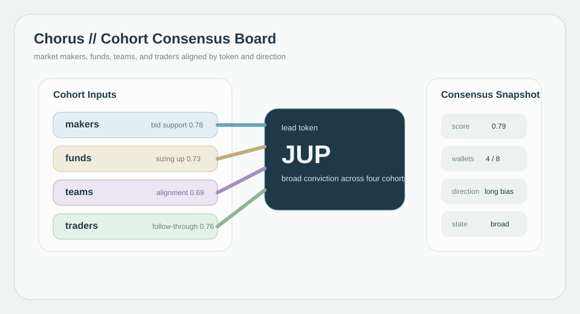
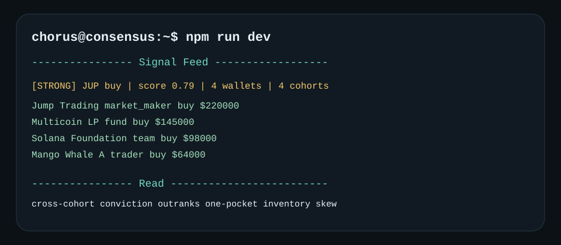

# Chorus

Cohort-consensus tracker for smart-money behavior on Solana.

Chorus watches curated wallets, but it does not collapse them into one bucket. Market makers, funds, teams, and traders are scored separately so the system can tell the difference between broad conviction and a single cohort dragging the tape.
That distinction matters because inventory skew from one cohort is not the same thing as market-wide agreement.

[](https://github.com/ChorusSignals/Chorus/actions)


## Consensus Map



## Signal Feed



## Technical Spec

Chorus computes agreement in two layers:

### Tier Weight

`tier1 = 3`

`tier2 = 2`

`tier3 = 1`

### Cohort Bonus

`market_maker = 1.2`

`fund = 1.1`

`team = 1.0`

`trader = 0.9`

### Consensus Score

`consensusScore = agreeingWeight / totalTrackedWeight`

Signals strengthen when multiple cohorts align. A single cohort can still be useful, but broad cross-cohort agreement is treated as the higher-conviction state.

## Quick Start

```bash
git clone https://github.com/ChorusSignals/Chorus
cd Chorus
npm install
cp .env.example .env
npm run dev
```

## Local Audit Docs

- [Commit sequence](docs/commit-sequence.md)
- [Issue drafts](docs/issue-drafts.md)

## License

MIT
